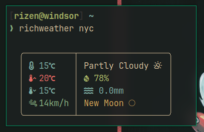

<div align="center">
<h1>richweather</h1>

> A Python-based command-line application that provides real-time weather information.

</div>

## Usage:
It is as simple as writing `richweather <city-name>`
Please note that the city name is not case sensitive and there are many ways you can enter it.
For example: New York can be written as: `New_York new_york NEw_yOrK "New york" NYC`

## Capabilities:
`richweather` displays the following info (in order):

**Left bar:**
- Current temp
- Day's max temp
- Day's min temp
- Wind speed

**Right Column**
- Weather
- Humidity *(in %age)*
- Precepitation *(in mm)*
- Moon phase

`richweather` uses [**nerdfonts**](https://www.nerdfonts.com/) to display the symbols. What I use is JetBrains Mono Nerd Font so I know it works. You can try different nerd fonts to see if your works.

## Installation
```bash
git clone https://github.com/Rizen54/richweather
cd richweather/
pip install .
```

## Socials
You can checkout my socials at my profile repo.
💬 My Discord server if you're interested in my projs: [Rizen's Server](https://discord.gg/BSCkxtxNJ6)

## Stars
Please support me by giving a star to this repo.
> Small click for a man, giant star for another.

## Where does richweather get its data from?
Since richweather uses the python-weather module it gets the data from [World Weather Online API](https://www.worldweatheronline.com)
